# Project: NoteApp
Giới thiệu:

**Họ và tên Sinh viên:** Hoàng Lê Đức Huy  
**Mã Sinh viên:** 23010298  
**Lớp:** CSE702051-1-3-24(COUR01.TH3)  

## 📝 Mô tả dự án

Website quản lý ghi chú, cho phép người dùng tạo ghi chú, phân loại.  

## 🧰 Công nghệ sử dụng
- PHP (Laravel Framework)
- Laravel Breeze
- MySQL (Aiven Cloud)
- Blade Template
- Tailwind CSS (do Breeze tích hợp sẵn)


# Sơ đồ khối
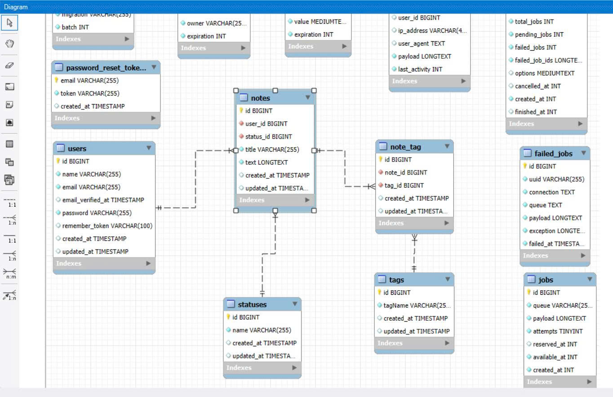

## Sơ đồ chức năng

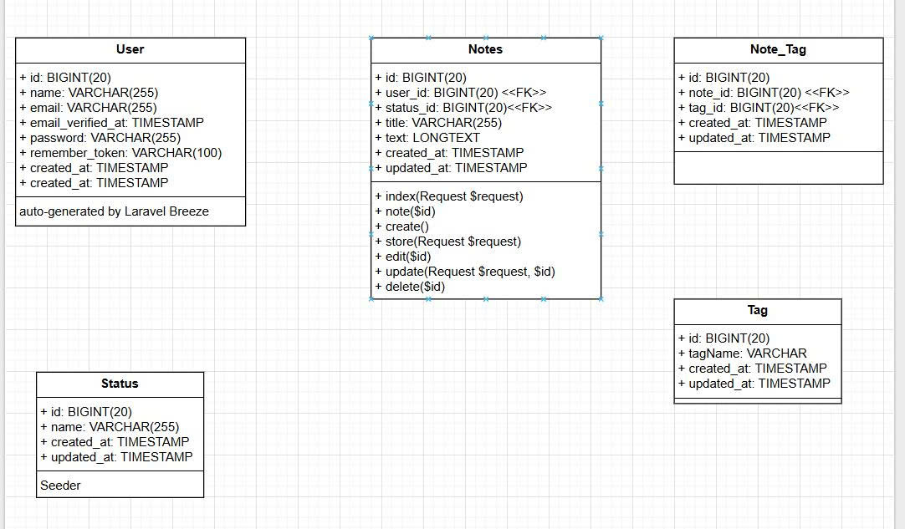

## Sơ đồ thuật toán

<strong>CRUD Note</strong>  


# Một số Code chính minh họa

## Model

<strong>Note Model</strong>

```php
class Note extends Model
{
     protected $fillable = ['title', 'text', 'user_id', 'status_id'];

    public function user()
    {
        return $this->belongsTo(User::class);
    }

    public function tags(){
        return $this->belongsToMany(Tag::class);
    }

    public function status(){
        return $this->belongsTo(Status::class);
   }
}

```
<strong>Tag Model</strong>

```php
class Tag extends Model
{
    protected $fillable = ['tagName'];

    public function notes() {
        return $this->belongsToMany(Note::class);
    }

}

```
<strong>Status Model</strong>

```php
class Status extends Model
{
    protected $fillable = ['name'];

    public function notes()
    {
        return $this->hasMany(Note::class);
    }
}

```


## Controller
<strong>Notes Controller</strong>

```php
class NotesController extends Controller
{

    //search
    public function index(Request $request)
    {
        $user = Auth::user();

        $query = Note::where('user_id', $user->id);

        if ($request->filled('search')) {
            $searchTerm = $request->search;
            $query->where(function ($q) use ($searchTerm) {
                $q->where('title', 'like', '%' . $searchTerm . '%')
                    ->orWhereHas('tags', function ($q2) use ($searchTerm) {
                        $q2->where('tagName', 'like', '%' . $searchTerm . '%');
                    });
            });
        }

        $notes = $query->with(['tags', 'status'])->paginate(10);

        return view('notes.index', ['notes' => $notes]);
    }

    //get
    public function note($id)
    {
        $user = Auth::user();
        $note = Note::where('id', $id)
            ->where('user_id', $user->id)
            ->with('tags', 'status')
            ->firstOrFail();

        return view('notes.note', [
            'note' => $note
        ]);
    }

    //create
    public function create()
    {
        $statuses = Status::all();
        return view('notes.form', compact('statuses'));
    }

    public function store(Request $request)
    {
        $validated = $request->validate([
            'title' => 'required|string|max:50',
            'text' => 'required|string|max:255',
            'tags' => 'nullable|string',
            'status_id' => 'required|exists:statuses,id',
        ]);

        $note = Note::create([
            'title' => $validated['title'],
            'text' => $validated['text'],
            'user_id' => auth()->id(),
            'status_id' => $validated['status_id'],
        ]);

        if ($request->filled('tags')) {
            $tagNames = array_map('trim', explode(',', $request->input('tags')));
            $tagIds = [];
            foreach ($tagNames as $tagName) {
                if (!empty($tagName)) {
                    $tag = Tag::firstOrCreate(['tagName' => $tagName]);
                    $tagIds[] = $tag->id;
                }
            }
            $note->tags()->sync($tagIds);
        }

        return redirect()->route('notes.index')->with('success', 'Note created successfully.');
    }

    //update
    public function edit($id)
    {
        $user = Auth::user();
        $note = Note::where('id', $id)
            ->where('user_id', $user->id)
            ->with('tags')
            ->firstOrFail();

        $statuses = Status::all();

        return view('notes.edit', compact('note', 'statuses'));
    }

    public function update(Request $request, $id)
    {
        $request->validate([
            'title' => 'required|string|max:50',
            'text' => 'required|string|max:255',
            'tags' => 'nullable|string',
            'status_id' => 'required|exists:statuses,id',
        ]);

        $user = Auth::user();
        $note = Note::where('id', $id)
            ->where('user_id', $user->id)
            ->firstOrFail();

        $note->title = $request->input('title');
        $note->text = $request->input('text');
        $note->status_id = $request->input('status_id');
        $note->save();

        $tagIds = [];
        if ($request->filled('tags')) {
            $tagNames = array_map('trim', explode(',', $request->input('tags')));
            foreach ($tagNames as $tagName) {
                if (!empty($tagName)) {
                    $tag = Tag::firstOrCreate(['tagName' => $tagName]);
                    $tagIds[] = $tag->id;
                }
            }
        }
        $note->tags()->sync($tagIds);

        return redirect()->route('notes.index')->with('success', 'Note updated successfully!');
    }

    //delete
    public function delete($id)
    {
        $user = Auth::user();
        $note = Note::where('id', $id)->where('user_id', $user->id)->firstOrFail();
        $note->delete();
        return redirect()->route('notes.index')->with('success', 'Note deleted successfully!');
    }
}

```

## View

<strong>
    Cấu trúc chính của view
</strong>

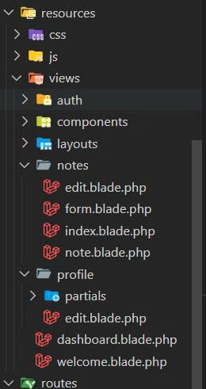

<strong>
    Sử dụng thư viện Tailwind CSS
</strong>


# Security Setup

<strong>
    Sử dụng @csrf để chống tấn công CSRF
</strong>

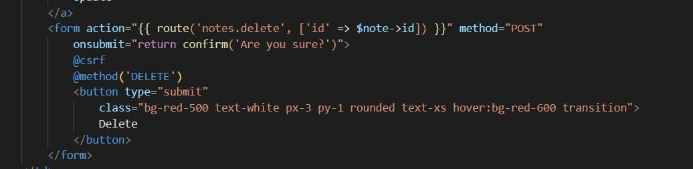

<strong>
    Chống XSS
</strong>

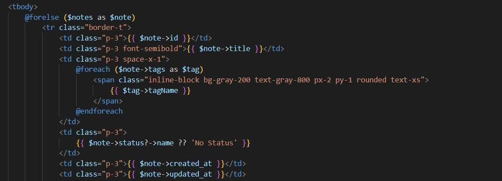

<strong>
    Validation: Ràng buộc dữ liệu
    Ví dụ method NotesController@store
</strong>

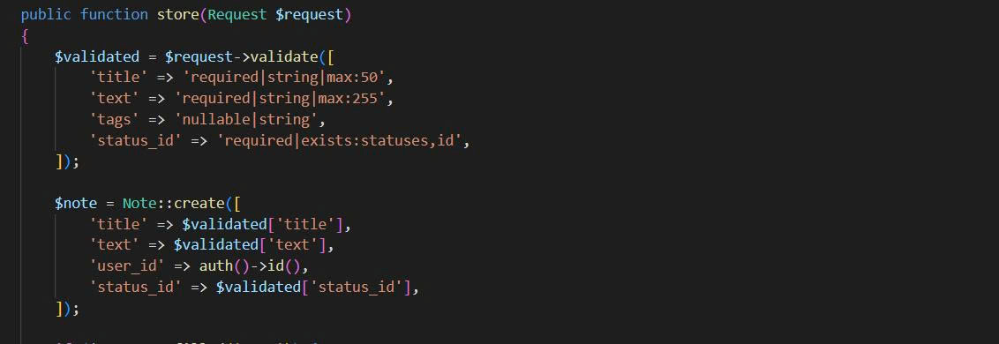

<strong>
    Query Builder Protection chống SQL Injection
</strong>

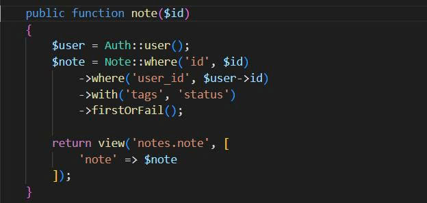

<strong>
    Middleware bảo mật
    Xử dụng các middleware auth của laravel
    Ví dụ: file routes/web.php
</strong>

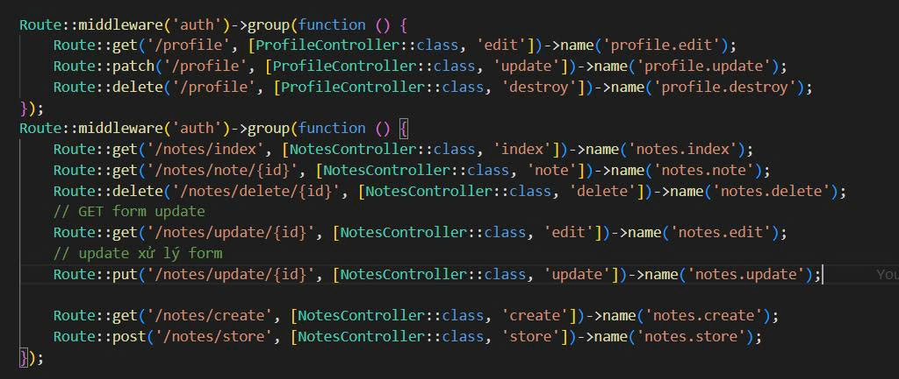

<strong>
    Authorization
method: NotesController@update
</strong>

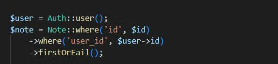

<strong>
    Authentication
    Ví dụ: Sử dụng Auth() để lấy thông tin user 1 cách an toàn
</strong>

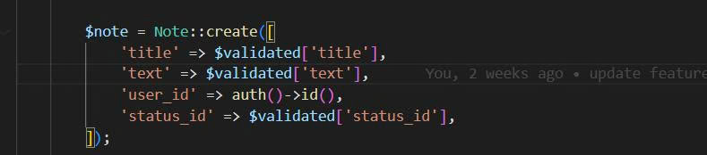

# Link

## Github Link

`https://github.com/DucHuy74/NoteApp_Laravel`

## Github page

`https://duchuy74.github.io/NoteApp_Laravel/`
## Link Demo : Youtube link
## Public Web (deployment) link: 

# Một số hình ảnh chức năng chính

## Xác thực người dùng <\<Breeze>\>

<strong>Trang đăng nhập</strong>

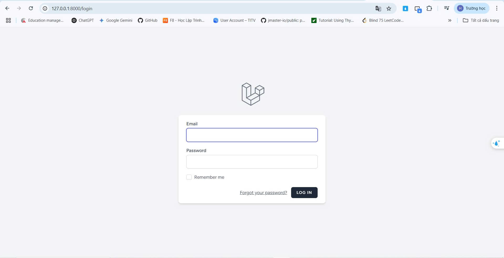

<strong>Trang đăng ký</strong>

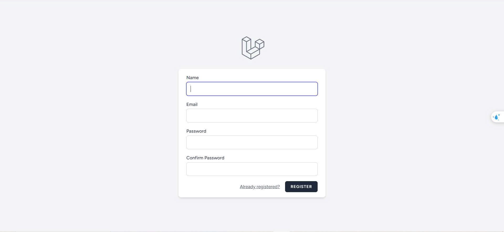

## Trang chính

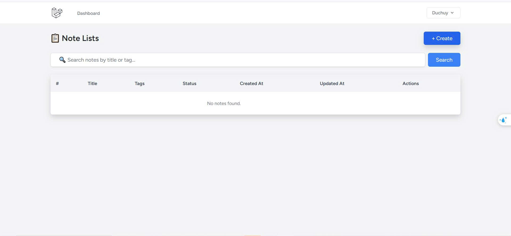

## CRUD Note

<strong>Create Note</strong>

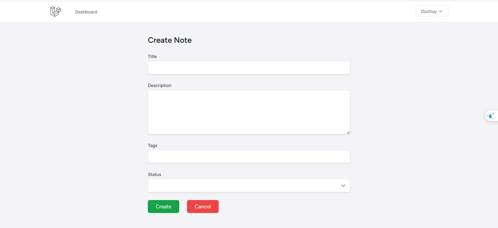

<strong>Read</strong>

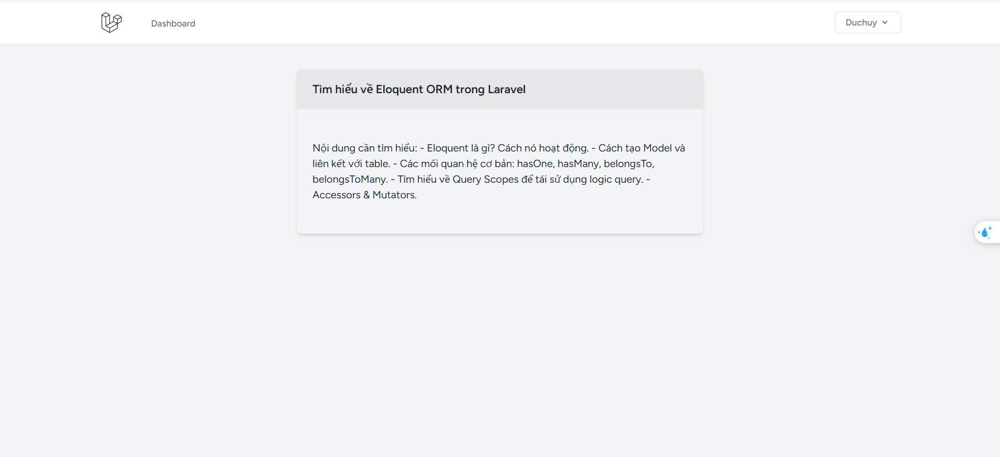

<strong>Update</strong>

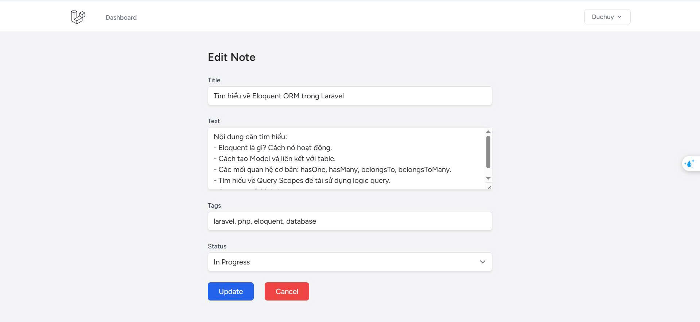

<strong>Delete</strong>

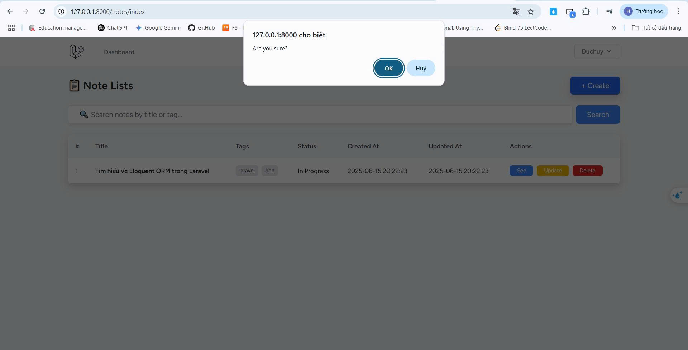

<strong>Search</strong>

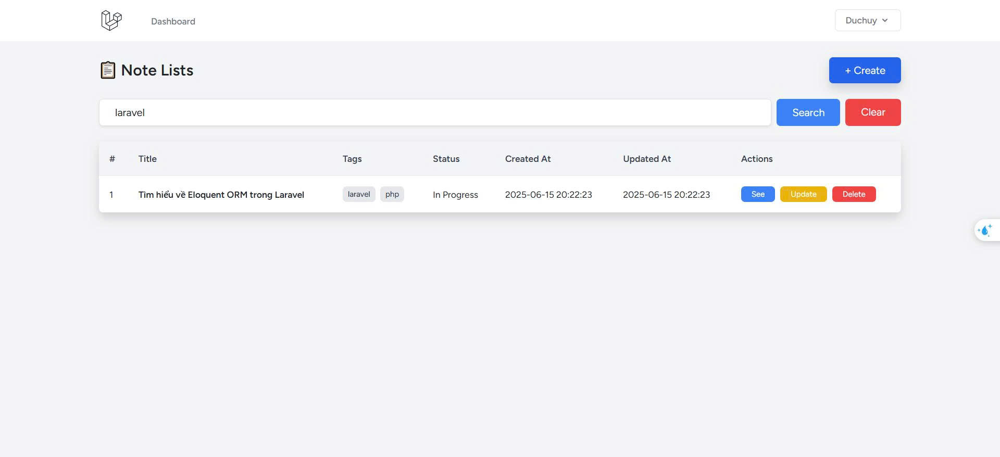

# License & Copy Rights

The Laravel framework is open-sourced software licensed under the [MIT license](https://opensource.org/licenses/MIT).
